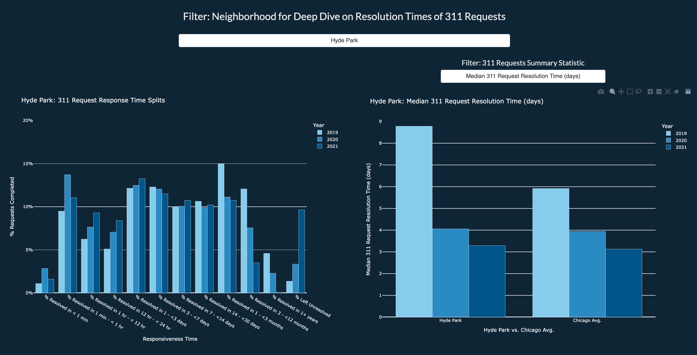
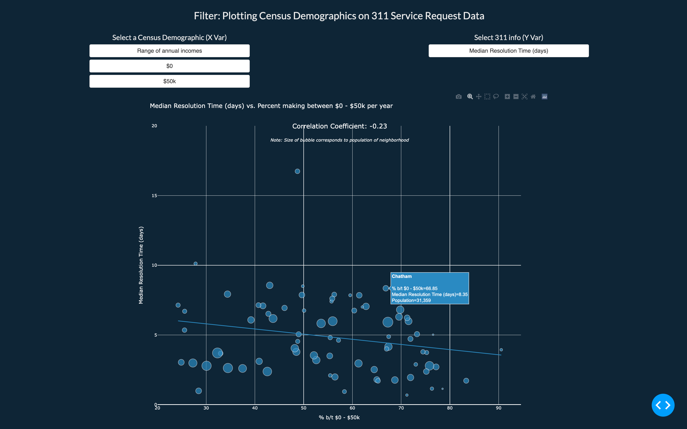

# 311 Service Mapping
## CAPP 122 Course Project | Winter 2022
## Team members: Vignesh Venkatachalam, Eujene Yum, Angela The, Matt Kaufmann

Using 311 Service Request information from the Chicago data portal, we analyze each neighborhood’s “responsiveness” to requests. We are using 311 data from 2019 to 2021 in order to capture a pre-peak-decline analysis of the pandemic impacts, and also layer in socio-economic information such as unemployment, income, and race. Our aim is to understand if there are discernable relationships between a neighborhood's demographic composition and responsiveness, types of issues, and any impact that COVID may have had on these metrics.

The WebApp has 3 main views that one can interact with:

### Responsiveness Map

### Neighborhood Deep dive

### Scatter-plot against key socio-economic measures

## Documentation
[Project Overview](proj-paper.pdf)

[311 Data Exploratory Data Analysis](servicemapping/deliverables/311_sr_analysis.ipynb)

## Instructions to execute project codes

**NOTE:** All codes to be run from within the `servicemapping/` directory

### Setting up Virtual Environment and installing required packages:
1. Clone this repo
2. From within `servicemapping/` run `sh install.sh`
3. Activate the virtual environment through `source env/bin/activate`

### Viewing WebApp:
1. Run `python3 -m mapping` (takes ~2 minutes)
2. Follow the generated URL link (eg: http://127.0.0.1:8050/) by copying it and pasting in your browser (On Mac, use `⌘` and click `Follow link` on the link generated)
3. The WebApp might take a few seconds to load all the maps and charts

### (Optional) Pulling Data from Data Portals

#### To view sample data API-pull from Chicago City Data portal: 
1. Run `python3 -m data_pull.sr311.sr_sample_data_collector` 
2. Sample dataset created is stored in `servicemapping/data/sr_sample_raw.csv`

#### To view census data API-pull from American Community Survey:
1. Run `python3 -m data_pull.census.get_census_data.py`
2. Sample dataset created is stored in `servicemapping/data/census_demos.csv`

#### To recreate underlying datasets - by re-pulling Service Request data from Chicago City portal: (Run Time: ~5 mins)
1. Run `python3 -m data_pull.sr311.sr_data_cleaning`
2. 3 datasets (`311_census_bar.csv`, `sr_census_df.csv` and `chicago_df.csv`) are created and stored in `servicemapping/data/`

## Interacting with the WebApp
