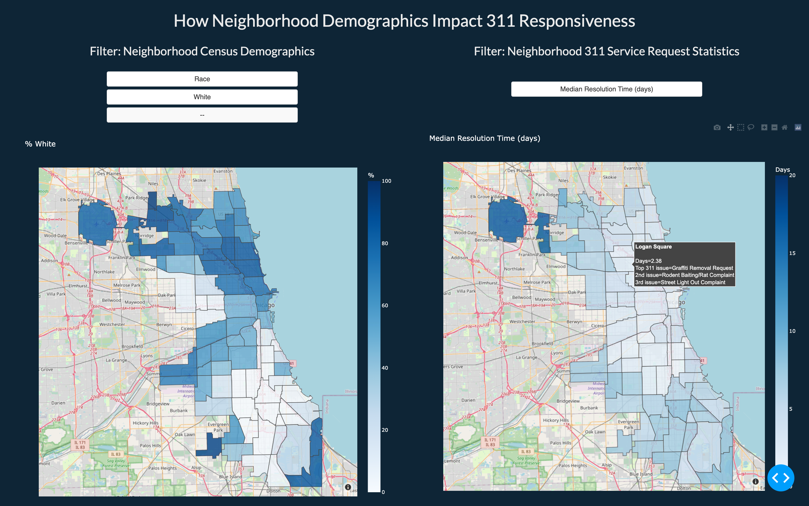

# 311 Service Mapping
## CAPP 122 Course Project | Winter 2022
### Team members: Vignesh Venkatachalam, Eujene Yum, Angela The, Matt Kaufmann

Using 311 Service Request information from the Chicago data portal, we analyze each neighborhood’s “responsiveness” to requests. We are using 311 data from 2019 to 2021 in order to capture a pre-peak-decline analysis of the pandemic impacts, and also layer in socio-economic information such as unemployment, income, and race. Our aim is to understand if there are discernable relationships between a neighborhood's demographic composition and responsiveness, types of issues, and any impact that COVID may have had on these metrics.

The WebApp has 3 main views that one can interact with:

### Responsiveness Map

### Community Area Deep dive

### Scatter-plot against key socio-economic measures

## Documentation
[Project Overview](proj-paper.pdf) 
[311 Data Exploratory Data Analysis](servicemapping/deliverables/311_sr_analysis.ipynb)
*(Recommended to open using Jupyter notebook)*

## Instructions to execute project codes

**NOTE:** All codes to be run from within the project root directory

### Setting up Virtual Environment and installing required packages:
1. Clone this repo
2. From within project root directory `proj-311_service_mapping_veam` run `sh install.sh` (takes ~2 minutes for all packages to install)
3. Activate the virtual environment through `source env/bin/activate`

### Viewing WebApp:
1. Run `python3 -m servicemapping` (takes ~2 minutes)
2. Follow the generated URL link (eg: http://127.0.0.1:8050/) by copying it and pasting in your browser (On Mac, use `⌘` and click `Follow link` on the link generated)
3. The WebApp might take a few seconds to load all the maps and charts

### (Optional) Pulling Data from Data Portals

#### To view sample data API-pull from Chicago City Data portal: 
1. Run `python3 -m servicemapping.data_pull.sr311.sr_sample_data_collector` 
2. Sample dataset created is stored in `servicemapping/data/sr_sample_raw.csv`

#### To view census data API-pull from American Community Survey:
1. Run `python3 -m servicemapping.data_pull.census.get_census_data.py`
2. Sample dataset created is stored in `servicemapping/data/census_demos.csv`

#### To recreate underlying datasets - by re-pulling Service Request data from Chicago City portal: (Run Time: ~5 mins)
1. Run `python3 -m servicemapping.data_pull.sr311.sr_data_cleaning`
2. 3 datasets (`311_census_bar.csv`, `sr_census_df.csv` and `chicago_df.csv`) are created and stored in `servicemapping/data/`

## Interacting with the WebApp

**1. Responsiveness Map:**
  1. On the left map, user can select specific demographic filters (and sub-filters) such as Race, Income Range and % Unemployed. The heatmap (and corresponding color gradation) will dynamically update for all Chicago community areas. Hovering over any community area shows the community area name and the corresponding metric value
  2. On the right map, user can choose from one of the 3 responsiveness metrics: Median Resolution Time, Average Resolution Time, Average Annual Service Requests per 1000 people, and the heat map will dynamically update for all Chicago community areas. **Hovering over any community area shows a tool-tip with community area name, the corresponding metric value and the Top-3 service requests for that particular community area in the past 3 years**

**2. Community Area Deep dive:**
User can **use the drop down to choose** the community area of interest, for which % of requests completed in different time buckets is shown for each year from 2019 to 2021. The bar chart also shows the % of issues unresolved. User can **click on any of the legends for the year** to view data for only a particular year or any pair of years. We've also provided a visual to compare the Median Request Resolution Time of the Community Area with Chicago as a whole

**3. Scatter Plot comparing responsiveness to Demographics**
User can **use the drop down to choose** the demographic attribute (Race, Income Range and % Unemployed) and the responsiveness metrics (Median Resolution Time, Average Resolution Time, Average Annual Service Requests per 1000 people) of interest, and the **scatterplot dynamically updates to show a scatter plot of responsive metrics vs demographic attribute values, along with the trend line**. Each bubble in the scatterplot corresponds to a community area, with its size indicating the population of the community area. Specific values can be gathered by hovering over the bubble.
